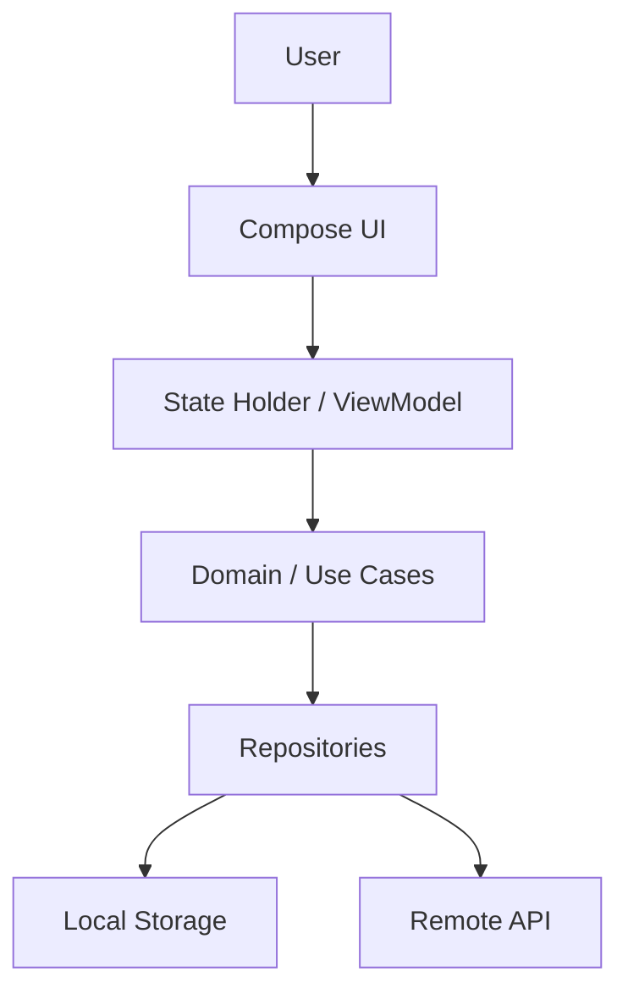

# Project Context Map Skill

## Purpose

Maintain a compact, durable conceptual map of this repository so future Claude Code sessions do not need to repeatedly re-read the whole project.

This skill is for reducing token usage, improving continuity, and keeping architectural understanding stable across long coding sessions.

## When to use

Use this skill when:
- starting work in this repository,
- the user says "ponte en contexto", "entiende el proyecto", "haz mapa", "ahorra tokens", or similar,
- the task touches architecture, navigation, data flow, state management, backend/API, database, authentication, UI flows, or cross-platform behavior,
- the session is becoming long,
- before or after a major refactor,
- before compaction.

## Outputs

Maintain these files:

1. `docs/AI_CONTEXT_MAP.md`
   Compact conceptual map of the project.

2. `docs/AI_TOKEN_INDEX.md`
   Fast lookup index: important files, folders, modules, responsibilities and when to read each one.

3. `docs/AI_SESSION_STATE.md`
   Short current-session checkpoint: current task, files touched, decisions made, pending work, commands run, failures.

4. `docs/AI_DECISION_LOG.md`
   Durable architectural decisions. Keep entries short.

Create the `docs/` folder if needed.

## Token rules

Do not read the whole repo blindly.

Preferred scan order:
1. `settings.gradle.kts`
2. root `build.gradle.kts`
3. version catalog files
4. `README.md`
5. existing docs
6. module-level Gradle files
7. package tree using `find`, `rg --files`, or equivalent
8. only then read specific source files that are necessary.

Avoid:
- dumping full large files,
- reading generated files,
- reading build folders,
- reading binaries,
- reading `.gradle`, `.idea`, `build`, `.git`, `node_modules`, or caches.

Prefer:
- file tree summaries,
- `rg --files`,
- `sed -n` for small ranges,
- `git diff --stat`,
- `git diff --name-only`,
- targeted reads.

## `AI_CONTEXT_MAP.md` structure

Use this structure:

```markdown
# AI Context Map

## Project identity
- Name:
- Type:
- Main platforms:
- Main stack:
- Current architectural style:

## Mental model
One paragraph explaining what the app does and how the main pieces fit together.

## Conceptual map



## Modules
One line per module/package: name, responsibility, key entry points.

## Cross-cutting concerns
Auth, navigation, DI, error handling, theming — where each lives.

## Known constraints and gotchas
Anything non-obvious that would waste tokens to rediscover.
```

## `AI_TOKEN_INDEX.md` structure

A flat, scannable table: path, what it contains, when to read it.

```markdown
# AI Token Index

| Path | Contains | Read when |
|------|----------|-----------|
```

Keep entries to the files/folders that actually matter — server routes, shared domain models, the main app modules, key screens. Do not index every file in the repo.

## `AI_SESSION_STATE.md` structure

```markdown
# AI Session State

## Current task
## Files touched this session
## Decisions made
## Pending work
## Commands run
## Failures / blockers
```

Overwrite this file each session (or at natural checkpoints) rather than appending indefinitely — it is a checkpoint, not a log.

## `AI_DECISION_LOG.md` structure

```markdown
# AI Decision Log

## YYYY-MM-DD — Short title
Decision, and the one-line reason. Nothing more.
```

Append-only. Keep each entry to 2-3 lines. This is for decisions that would otherwise be silently re-litigated in a future session (e.g. "why Ktor over Retrofit", "why the invoices module lives in shared/ instead of composeApp/").

## Workflow

1. Check if `docs/AI_CONTEXT_MAP.md` exists.
   - If yes: read it first, along with `AI_TOKEN_INDEX.md` and `AI_SESSION_STATE.md`. Trust it as a starting point, but verify anything load-bearing against the actual code before acting on it — the map can drift from reality.
   - If no: build it using the token rules above, then write all four files.
2. During the session, keep `AI_SESSION_STATE.md` roughly current at natural checkpoints (not after every single tool call).
3. When a durable architectural decision is made, append one entry to `AI_DECISION_LOG.md`.
4. After a major refactor, or when the map is noticeably stale, regenerate the affected sections of `AI_CONTEXT_MAP.md` and `AI_TOKEN_INDEX.md` rather than the whole file.
