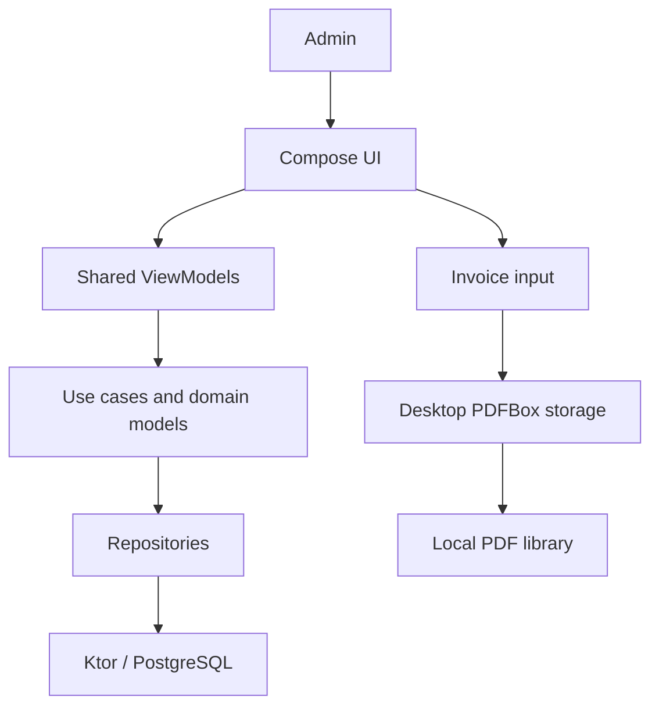

# AI Context Map

## Project identity
- Name: OryKai software
- Type: Kotlin Multiplatform CRM for freelance support work
- Main platforms: Desktop JVM, Android, iOS; Ktor server
- Main stack: Compose Multiplatform, coroutines/Flow, Ktor, PostgreSQL, PDFBox
- Current architectural style: feature-oriented data/domain/presentation with lightweight MVVM

## Mental model
The Compose client renders feature state from shared ViewModels. Most operational data is fetched through shared repositories and the Ktor server. Invoices are a deliberate exception: the desktop client composes PDFs directly with PDFBox and stores them only in the local `Desktop/Facturas OryKai` folder.

The client portal is being planned to evolve into a continuity CRM: it will reuse tickets, tasks, time logs and current client-scoped authentication, then add server-authorized feature entitlements, client members and optional product modules. AI, if approved, must be Ktor-mediated, source-grounded and client-scoped; it must never receive authority to send, bill or mutate data without human confirmation.

## Conceptual map

## Modules
- `composeApp`: Compose UI, navigation and desktop/Android/iOS entry points; invoice form is `AdminInvoicesScreen`.
- `composeApp/.../app/client`: current client portal. `ClientPortalScreen` owns the current destinations and composes home, tickets, tasks, board, service, activity and account screens.
- `composeApp/.../app/client/screens/ClientWorkScreen.kt`: grouped client-work landing screen; keeps tickets, tasks, board and activity reachable without making them top-level navigation.
- `shared`: domain models, feature ViewModels, repositories and platform abstractions; invoice input is in `commonMain` and PDF storage has platform actuals.
- `server`: Ktor API and PostgreSQL integration for CRM data; it must not handle invoices.
- `iosApp` / `androidApp` / `desktopApp`: platform wrappers.

## Cross-cutting concerns
- Navigation: `shared/core/navigation/AppDestination.kt`, rendered by `AdminWorkspaceApp`.
- DI/construction: `SupportDeskSharedModule` builds shared ViewModels and repositories.
- State: immutable `StateFlow` plus one-off effects from `BaseViewModel` subclasses.
- Client portal auth: creating a client atomically creates its portal user. The server generates an `SBS-XXXX-XXXX-XXXX` code, returns it only in the creation/regeneration response, and stores only a BCrypt hash in `users`. Admins regenerate it at `/admin/clients/{id}/credentials/regenerate`; refresh tokens are revoked.
- Client isolation: request identity carries `clientId`; ticket, task and time-log routes derive client scope from identity for client users. Dedicated `/client/profile`, `/client/tickets`, `/client/tasks`, `/client/time-logs` and `/client/overview` routes are scoped to that identity and omit ticket internal comments.
- Client modules: `ClientPortalComponent` currently exposes `SERVICE_SLA`. Its entitlement is stored in `client_component_entitlements`, changed only by an admin at `PUT /admin/clients/{id}/components`, and returned in the normal client payload.
- CRM continuity: V6 adds admin-only client contacts and follow-up activities. They are managed under `/admin/clients/{id}/contacts` and `/admin/clients/{id}/activities`; they must never be exposed in the client portal without a separate product decision.
- Database security: V7 enables PostgreSQL RLS for every live `public` table and revokes Supabase Data API roles (`anon` and `authenticated`) plus `PUBLIC` from direct schema objects. Ktor owns authentication and database access, so no Supabase Auth RLS policy is defined.
- Theme: Compose design-system tokens under `composeApp/.../designsystem`.
- Errors: feature ViewModels map failures to state and `ShowMessage` effects.

## Known constraints and gotchas
- Invoices, invoice lines, invoice IDs and download URLs must never be persisted or sent through Ktor/HTTP. Deleting an invoice deletes only its selected local PDF after confirmation.
- The invoice number is ephemeral and PDFs are generated/opened only on desktop JVM.
- A task invoice line uses its recorded seconds rounded upward to complete hours before creating the invoice input.
- Android and iOS invoice storage are intentionally unsupported.
- Portal access codes must be treated as credentials: never retain a reusable plaintext code in PostgreSQL or expose it after generation.
- CRM modules are not billing by themselves: entitlement/catalog persistence belongs on the server, while recurring collection needs a separately approved billing domain. Do not repurpose local invoice PDFs as subscriptions.
- The current first commercial vertical is manual activation of Service and SLA. Priority/VIP existing accounts are backfilled by migration V5; do not use service tier as the future source of truth for all modules.
- V6 is the final CRM feature migration. V7 is the explicitly authorized security-only migration; future portal enhancements should reuse the established API/read models unless the product scope is explicitly reopened.
